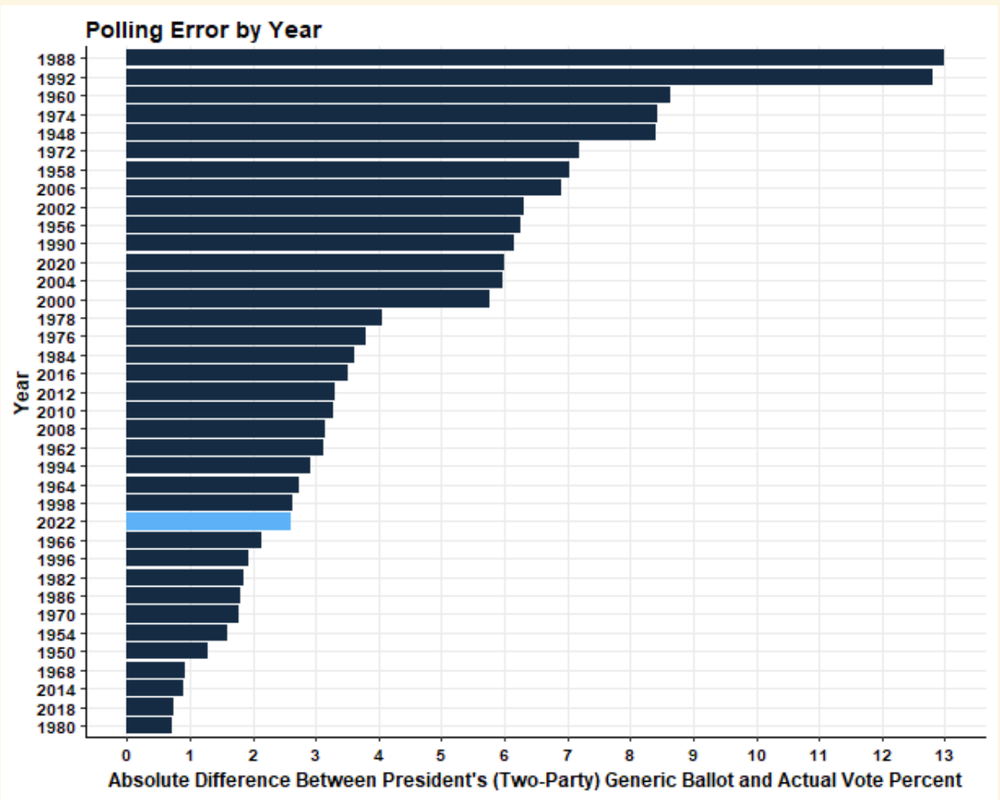

```{r, eval = TRUE, echo = FALSE, warning = FALSE, message= FALSE, Include = FALSE}
library(dotenv)
library(jsonlite)
library(lubridate)
library(gridExtra)
library(tidyverse)
library(blogdown)
library(stargazer)
library(readr)
library(usmap)
library(rmapshaper)
library(sf)
library(janitor)
library(tigris)
library(leaflet)
library(scales)
library(dplyr)
```

After a long semester of model making and an even longer campaign season, the midterm elections are finally in the rearview.  To the surprise of many, no red wave came despite an increasingly dire media narrative and tightening polls in the days leading up to the midterm elections.  While final vote tallies are still being counted we have a good enough idea of where the final tally stands.  As of November 22nd, Democrats have held the Senate and await a Runoff election in Georgia to determine if they will expand their slim majority.  

In the house, which is our focus area, Democrats have lost their slim majority with a final predicted split of 213 seats for Democrats and 222 seats for Republicans.  These minimal losses are very strong showing for the Democrats but how do they compare to my final model?

#Describing the Model

As a refresher the final model I used in my prediction was: 

Y = 33.910 -0.554* X1 + 0.604* X2 -2.874* X3

whereas,

Y = Democratic party popular vote share of two major parties (%)

X1 = The percent change in real disposable income between quarters 7 and 8 of a given election year

X2 = Support for Democrats based on an average of generic ballot polling (%)

X3 = The average expert rating for a given district in a given year (1-7)

Data for average expert rating included predictions from Cook Political, Real Clear Politics, Rothenerg, cq politics, and Sabato’s Crystal Ball. Generic ballot polling was based on generic ballot averages from September to election day of a given year. To predict, I plugged in the current data on RDI change over the last quarter, current Democratic generic ballot averages from Real Clear Politics, and average expert rating across all districts. This value was calculated using the expert predictions 2022 scrape provided to the course. This aggregates district ratings for all districts from predictions by Cook, Rothenberg, Sabato's Crystal Ball and Real Clear Politics.

Based on the final model, I predicted that Democrats would win 49.5% of the two party vote share and Republicans will win 50.5% of the two party vote share. Due to limited data availability the prediction interval was very large with the prediction falling between 44-55 points for Democrats. Using a bivariate model to convert popular vote share to seat share, I also predicted that Democrats would win 209 House seats and Republicans would win 226. This prediction had a large uncertainty interval with a low of 179 seats and a high of 237 seats.

I also included a simple model for NH-01 which is the district I’ve been following this semester. The rough model includes average expert rating and incumbency. While the predictive power of this model was quite low, I nevertheless predicted with a great deal of uncertainty that Chris Pappas would narrowly take NH-01, over challenger Karoline Leavitt winning a two party vote share of 50.24%.

#Assesing My Predictions

```{r, eval = TRUE, echo = FALSE, warning = FALSE, message= FALSE, Include = FALSE}

#Seat Share Plot
seatsdf <- read_csv("outcome_seats.csv") %>% 
  rename_("party" = "...1")

seatsdf %>%  
  ggplot(aes(x = "", y = Seats, fill= factor(party, levels=c("R", "D")))) + 
  geom_col(width = .25, position = position_fill(reverse = FALSE)) + 
  scale_fill_manual(values = c("red", "blue")) + 
  labs(y= "Seats", x = "118th Congress", fill = "Party") +
  coord_flip() +
  geom_hline(yintercept = (209/435), size = 1.5) +
       annotate("text", x=(1.25), y= 0.37, label="Predicted Seats", size=4) +
        annotate("text", x=(1), y= 0.25, label="213", size=6) +
        annotate("text", x=(1), y= 0.75, label="222", size=6)+
  ggtitle("Actual 2022 Seat Share ") 

```

My final prediction for Democratic Seat Share was 209 seats for Democrats. The actual outcome was 213 seats for Democrats. This means that my model underestimated the strength of Democrats in the 2022 midterm elections by 4 seats.  This prediction is within the model’s uncertainty interval (180 - 237 seats). However, as explained extensively in my blog post the day before the election, data limitations, particularly dealing with expert predictions, made it difficult/impossible to reduce the uncertainty interval without ditching expert predictions as a predictive variable. 

```{r, eval = TRUE, echo = FALSE, warning = FALSE, message= FALSE, Include = FALSE}
seatsdf %>%  
  ggplot(aes(x = "", y = `Popular Vote Share`, fill= factor(party, levels=c("R", "D")))) + 
  geom_col(width = .25, position = position_fill(reverse = FALSE)) + 
  scale_fill_manual(values = c("red", "blue")) + 
  labs(y= "Seats", x = "118th Congress", fill = "Party") +
  coord_flip() +
  geom_hline(yintercept = (0.495), size = 1.5) +
       annotate("text", x=(1.25), y= 0.37, label="Predicted Vote \n Share (49.5%D)", size=4) +
        annotate("text", x=(1), y= 0.25, label="48.3%", size=6) +
        annotate("text", x=(1), y= 0.75, label="51.7%", size=6)+
  ggtitle("Actual 2022 Vote Share ") 
```

Interestingly, I predicted that Democrats would win 49.5% of the two party vote share. This model overestimated the performance of Democrats in the popular vote during the 2022 midterm elections. The actual Democratic two party vote share was 48.3% so the error of the model was -1.18 percentage points. This is also within the margin of error. However, this is once again to be expected given the large confidence interval (44 - 55) as a result of limited data availability. 

The table below summarizes my predictions and accuracy.

```{r, eval = TRUE, echo = FALSE, warning = FALSE, message= FALSE, Include = FALSE}
library("kableExtra")

findings <- read_csv("results.csv")

kable(findings) %>% 
  kable_classic(full_width = F, html_font = "Cambria")
```

Given that I only created a national model, I unfortunately cannot analyze my prediction accuracy on a state by state or region basis. However, I have done my best in the next section to put my model’s accuracy into historical context at the national level. 

#Sources of Inaccuracy

My model incorporated generic ballot polling, expert predictions, and RDI. There are plausible issues with each of these metrics so I will walk through a potential issue with each of these three predictive variables. 

RDI - RDI was not a significant coefficient in my model. However, I chose to include it anyway because I thought it was important to include some measure of the economy in my model. That being said, in the model RDI was a negative coefficient suggesting that an increase in RDI change was associated with a decrease in support for Democrats. This doesn’t make a ton of sense but could be a result of limited years to predict off of. My final model incorporates only district level data from 2010, 2014, and 2018. Both 2010 and 2014 were good midterm years for Republicans with 2010 being a historic red wave. This may be the source of this unexpected relationship.

Furthermore, there are greater concerns with economic measures in this midterm election specifically.  Current economic conditions are unprecedented.  Inflations and RDI change remain bad but other metrics like unemployment are at all time lows. This might mean that how voters make their election decisions in relation to previously linked economic measures no longer applies. Alternatively, we might hypothesize that something like Consumer Satisfaction might more accurately portray that cumulative interpretation that voters have about the economy.


Polling - Generic Ballot has never been a perfect predictor of two party vote share. However, all things considered, the polling data for the 2022 midterms appears to have been pretty accurate in relation to previous midterm elections.  As seen on the graph below, 2022 ranks in the bottom quarter of difference between polls and election results. For this reason I don’t believe that this was a major source of inaccuracy in my national model.  

That being said, while I did not create a district by district model I do think that generic ballot data could have hurt those models and hurt district models at large including my NH-01 model.  Generic ballot data smooths voter perception of the two major parties and removes any consideration of candidate quality.  However, one major trend and narrative out of these midterms is the question for candidate quality. For example, we’ve seen that the vast majority of election denying challengers against incumbent Democrats lost (CBS news). This suggests that candidate quality matters and races are individual as much as national. 


*Graph Generated by Professor Ryan Enos*


Expert Predictions - While the expert predictions were for the most part correct, I think that they are the largest source of inaccuracy in my model. Based on average expert rating, 17 districts were predicted incorrectly (CA13, CA22, NC13, NY03, NY04, NY17, NY18, NY19, NY22, OR05, PA01, VA01, VA02, VA05, VA06, VA09, WA03). As we can see many of these incorrectly predicted districts were in New York and Virginia. In New York specifically, this is likely a product of uncertainty introduced due to redistricting. These predictions were systematically off. Furthermore, there may be something at play with the fact that expert predictions have embraced uncertainty in a post-2016 environment. 

```{r, eval = TRUE, echo = FALSE, warning = FALSE, message= FALSE, Include = FALSE}
districtres <- read_csv("districtres.csv")

cd116 <- congressional_districts(
  state = NULL,
  cb = FALSE,
  resolution = "500k",
  year = 2018)

cd116 <- cd116 %>%
  rename_("state" = "STATEFP")
  
state <- read_csv("us-state.csv")

state <- state %>%
  rename_("state" = "st")

district <- cd116 %>%
  left_join(state, by = "state")
  
district2 <- district %>%
  select(-c("state")) %>%
  rename_("state" = "stname", "district" = "CD116FP", "st" = "stusps")

district2$district <- as.numeric(district2$district)

district2 <- district2 %>%
  mutate(district = case_when(
    district == 0 ~ 1,
    TRUE ~ district
  ))

#merge data 
combined <- district2 %>%
  left_join(districtres, by = c("state", "district"))

#simplifiy for plot
simpdata <- combined %>%
  filter(state != "Alaska", state != "Hawaii") %>%
  #rename("st" = "stusps") %>%
  mutate(district = case_when(
    district == 0 ~ 1,
    TRUE ~ district
  )) %>%
  ms_simplify()

simpdata$district <- as.numeric(simpdata$district)

#Plot correct districts
ggplot() + 
  geom_sf(data=simpdata,aes(fill=accuracy),
          inherit.aes=FALSE,alpha=0.9)+
  theme_void() +
  theme(axis.title.x=element_blank(),
        axis.text.x=element_blank(),
        axis.ticks.x=element_blank(),
        axis.title.y=element_blank(),
        axis.text.y=element_blank(),
        axis.ticks.y=element_blank()) +
  labs(title = "Was Average Expert Prediction Correct?")
```

When pollsters and experts were so far off in 2016, they received a lot of backlash over their incorrect predictions. Since they have attempted to correct for this by highlighting and underscoring the uncertainty in all of their predictions. This might make exports more likely to place a district as Leans D over Solid D serving as a moderating force in the data. Since my model only trained off of data from 2010, 2014, and 2018, there might be reason to believe that thresholds/approaches to giving predictions have changed in a way that means the training data is unrepresentative of the current dynamic between race outcomes and expert ratings. 

#How could we test these theories, hypothetically?

One test I would be interested in conducting is a more comprehensive look at how expert predictions have shifted over time.  Is it true that they have become more reserved in predicting races?  In order to look at the data in this way I would need a comprehensive set of expert predictions dating as far back as possible, However, just seeing a moderating trend in averages could not show this definitely you would somehow have to control for the political environment along any number of variables that have been considered in models above and throughout the semester to actually examine this drift. .  

To test my hypothesis about RDI and the economy would be easier (in theory of course). I would just need a dataset containing a comprehensive array of economic indicators which I would run a regression with against election outcomes to try and see if a) consumer sentiment is a better predictor of election outcomes and b) if the predictive power of something like RDI is just an outlier in 2022. 

Finally, it would be more difficult to quantify the sentiment that elections in general are more (or less as suggested by the 2022 results) nationalized.  Perhaps this could be done by quantifying and charting the number of races called incorrectly by a fundamental model. In this way you could try to measure the number of races that diverge from the expected nation trend thereby measuring how “individualized” races are. This is of course wrought with concern over what counts as fundamental and would be highly susceptible for p-hacking based on what indicators are incorporated in whatever is in the fundamental model. 

#What I would do differently next election...

There are several things I would try to change about my model if I were to do it again. The first thing I would do is make separate district level models and national models.  For my national model I would attempt to take a strictly fundamentals approach.  This would include things like presidential incumbency, a midterm year term variable, turnout (maybe by age since that was so important to 2022) and an economic metric (potentially consumer satisfaction).  This way I would have one national model training on good, reliable, comprehensive data that would go back as far as the mid 1900’s (though I would likely still restrict the dataset to post 70’s since I believe politics have fundamentally changed since then).  I would complement this model with a district level model that attempts to incorporate more of the campaign/district specific parameters. This would include expert ratings which are still a very powerful predictive tool at a level where data is notoriously unreliable.  Ideally, I would also try to incorporate more finicky variables like candidate quality (perhaps a binary variable for previous experience in elected office),  if there is a competitive Senate race in a given state, district level polling averages, etc, candidate incumbency, etc. This way my district models could actually contribute by attempting to capture the campaign level dynamics at play.

I think that this two model approach would provide a rich set of predictions that would not only be accurate (hopefully) but could also tease out some of the discrepancies between the “old reliable” fundamentals model and the more flexible district level models. Granted, as with making my model for 2022, the biggest issue with all of these desired models is the availability of data.  For variables that are not easily scraped and compiled (ie. historical district ratings, data related to redistricting, etc) compiling enough data so as not to greatly limit your training data set is time intensive and difficult. But if I were to assume the same time and skill restrictions I faced this semester, then I would stick to a fundamentals model and ditch expert ratings to maintain a clean, comprehensive set of data to train on. 

